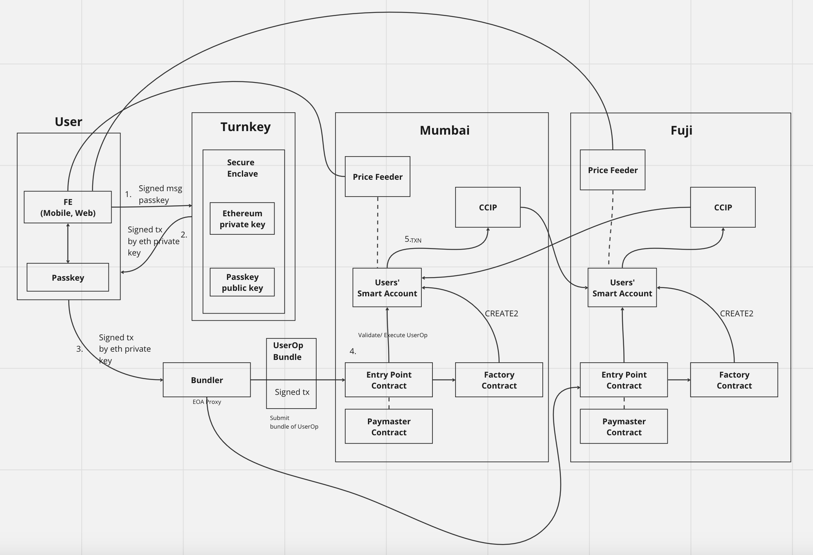

# Multi chain Account Abstraction

A Non-custodian Multi-Chain Smart Wallet helping web2 users to easily and 
securely access web3 by account abstraction wallet(ERC4337), passkey and CCIP.

## Project Structure

- webapp-fe
```
webapp-fe is frontend, It built with NextJS, Ethers, passkey and integrate with stackup infrastructure for erc4337(Bundler and Paymaster)
```
- smartcontract
```
smartcontract folder contains contracts that is solidity, It contains of factory and account countract that use erc4337 standard, Price Feeder for Mumbai and Fuji, CCIP Contract(TokenTransferor)
```

CCIP Transaction (Transfer CCIP-BnM router from Mumbai to Fuji)
https://ccip.chain.link/msg/0xb6dd9dcca4d891f7ffc8ee52eb9aa9fddc88dbaa05c922a8259d69b48569c234

TokenTransferor Contract
https://mumbai.polygonscan.com/address/0x19F2b3e2a630F7F2CC0E64dE96CfCBDd45ca51Fa

https://testnet.snowtrace.io/address/0x6E78c61C600Ba9559Bc9eE3469848421606EC7Fc

User Operation Transaction 
https://mumbai.polygonscan.com/tx/0xd8cef4a95f6289baa145d117500ee61797a3f963eb7a7e5c7682785c50f21f9f

Price Feed Oracle Contracts 
https://mumbai.polygonscan.com/address/0xEA0128f5339014D7a82d50444b902b10F3E00992
https://testnet.snowtrace.io/address/0xEA0128f5339014D7a82d50444b902b10F3E00992
 
Smart Contract Wallet 
https://mumbai.polygonscan.com/address/0x1D45D389E38Fd1b7c5D1BE163aA3baa4466d279b




Pitchdeck
https://www.canva.com/design/DAF2oE4IrJY/ZSOmvMbgQ-orVTN23d5reA/edit?utm_content=DAF2oE4IrJY&utm_campaign=designshare&utm_medium=link2&utm_source=sharebutton


